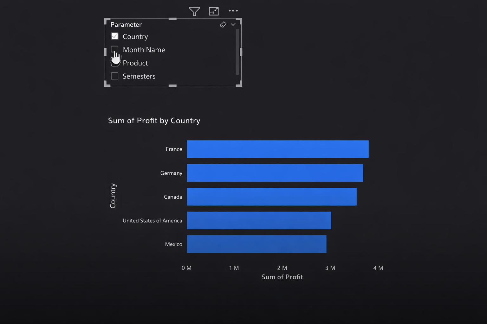
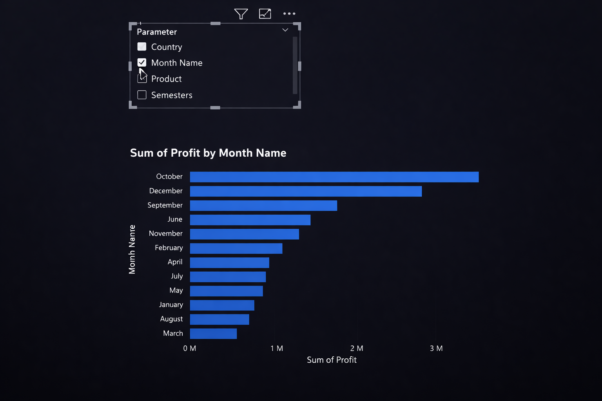
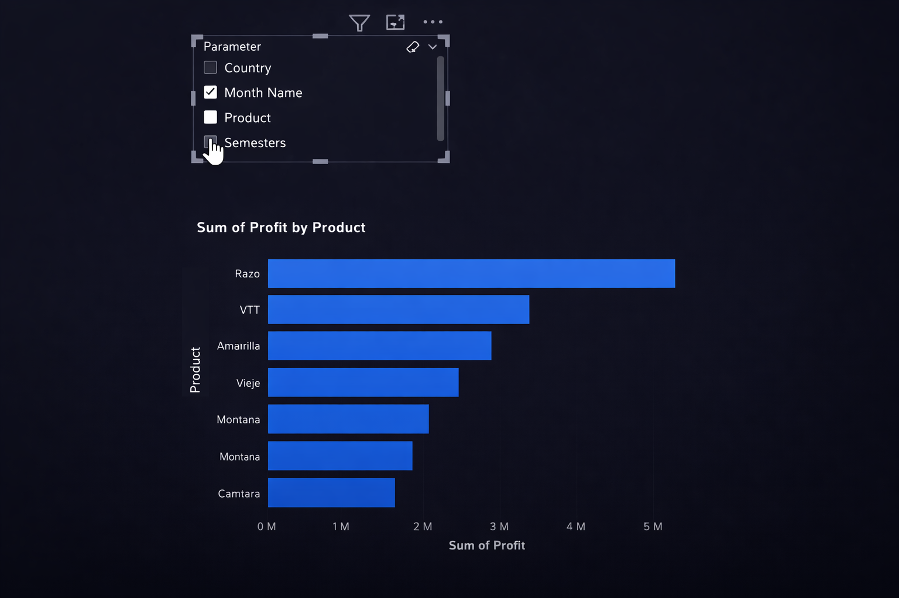
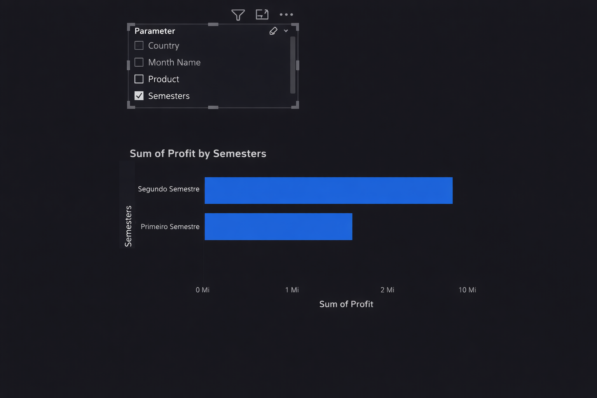

Daily learning

# Creating Dynamic Reports Using Parameters in Power BI

Project developed at the Bootcamp Power BI Analyst Training, under the guidance of specialist [Juliana Zanelatto](https://github.com/julianazanelatto/ "Juliana Zanelatto").

Using the report from the previous challenge, you will create at least two visuals considering the creation of parameters.

Following the same steps used during the course, create the field parameters.
Therefore, the guidelines are:

- First view: parameter based on categories
- Second view: parameters based on values ​​(profit, sales, or others)
- Follow the same styling as the report
- Create a story to present (to the client) this view of the data.

Country

Month Name

Product

Semester

[LICENSE](/LICENSE)

See [original repository](https://github.com/julianazanelatto/power_bi_analyst).
